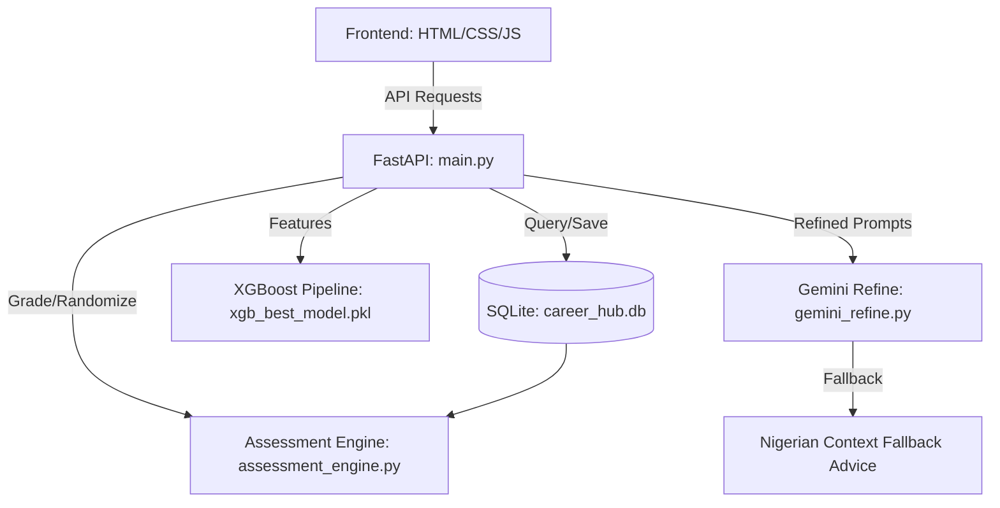
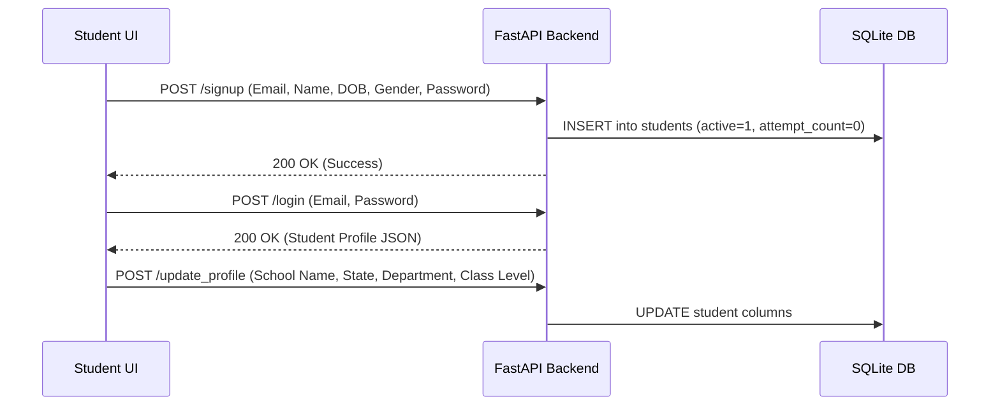
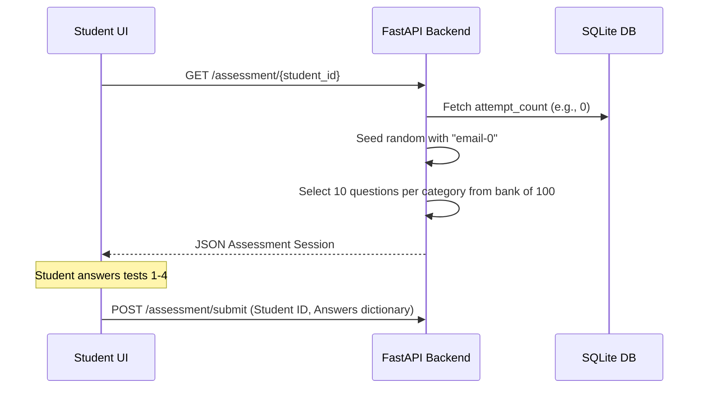
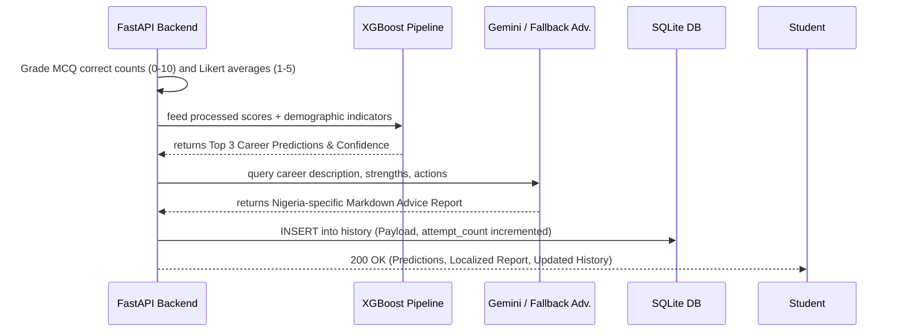

# Smart-career-predictor-Code

# Architecture, Workflow, and Verification Report

This walkthrough outlines the complete system design, architecture, database schemas, dynamic algorithms, testing results, and system lapses for the **Smart Career Predictor App**.

---

## 1. System Architecture

The application is structured as a decoupled web application served by a FastAPI backend:



### Components:
1.  **Frontend Presentation Layer (`smart-career-predictor.html`)**: A responsive single-page HTML5/JS client featuring transition controls, onboarding setup panels, result uploads, and the dynamic **Assessment Hub** which runs timed, multi-choice tests.
2.  **API Gateway Layer (`main.py`)**: Defines Pydantic models for incoming requests, exposes auth and profile endpoints, and implements `/assessment/submit` which handles multi-phase pipelines (grading $\rightarrow$ classification $\rightarrow$ LLM generation).
3.  **Core Domain Logic (`assessment_engine.py`)**: Runs database setups, student profile writes, and dynamic randomized question session generation.
4.  **Inference Layer (`predict.py`)**: Loads the scikit-learn preprocessing and serialized XGBoost pipelines to compute primary, secondary, and tertiary career match probabilities.
5.  **Advisory Engine (`gemini_refine.py`)**: Translates classification indices and psychometric profiles into professional mentor reports, utilizing local fallback advice matrices when Google API key restrictions are active.

---

## 2. System Workflow

The user journey is automated through a synchronized state machine between frontend and backend:

### Step 1: Authentication & Profiling


### Step 2: Assessment Hub & Dynamic Grading


### Step 3: Inference & Report Compilation


---

## 3. SQLite Database Schema

The SQLite schema is designed to allow simple, clean scaling to Firebase or PostgreSQL:

### `students` Table
Stores student accounts, demographics, current class standing, and cumulative credentials:
*   `email` (TEXT PRIMARY KEY): Unique identifier.
*   `name` (TEXT): Full name.
*   `password_hash` (TEXT): Secure hash of the student's password.
*   `phone` (TEXT): Contact number.
*   `dob` (TEXT): Date of Birth.
*   `gender` (TEXT): Gender label.
*   `school_name` (TEXT NULL): Name of secondary school.
*   `school_type` (TEXT NULL): Public/Private indicator.
*   `state` (TEXT NULL): Nigerian state.
*   `class_level` (TEXT NULL): Current grade (`SSS 1`, `SSS 2`, `SSS 3`).
*   `department` (TEXT NULL): Academic stream (`Science`, `Arts`, `Commercial`).
*   `language` (TEXT NULL): Preferred interface language.
*   `uploaded_results` (TEXT NULL): JSON array of completed educational levels (e.g., `["SSS 1"]`).
*   `attempt_count` (INTEGER DEFAULT 0): Assessment session count.

### `history` Table
Stores chronological records of prediction payloads and reports:
*   `id` (INTEGER PRIMARY KEY AUTOINCREMENT): Row identifier.
*   `student_id` (TEXT): References `students(email)`.
*   `attempt_number` (INTEGER): Attempt index.
*   `payload` (TEXT): Complete JSON dump of test scores, predictions, and report text.
*   `created_at` (TEXT): UTC timestamp.

---

## 4. Verification Results

A suite of unit and integration tests was written and executed inside the project's virtual environment:

### Command Run:
```bash
.venv\Scripts\pytest
```

### Results Summary:
*   **Total Tests**: 5
*   **Status**: `PASSED`
*   **Duration**: 12.34 seconds
*   **Covered Sections**:
    1.  `test_prediction_returns_structure`: Verifies XGBoost classifier outputs predicted career, confidence score, and top 3 path listings.
    2.  `test_assessment_session_contains_questions`: Confirms dynamic random question allocation fetches exactly 10 questions per category.
    3.  `test_grading_logic`: Validates mathematical grading bounds (Aptitude/Cognitive scored 0-10, Psychometric/Personality scaled 1-5).
    4.  `test_signup_login_flow`: Tests secure endpoints, credential validation, and duplicate signup errors.
    5.  `test_profile_update_and_submit`: Tests end-to-end integration mapping frontend JSON profiles directly into SQLite writes and grading predictions.

---

## 5. Identified Lapses and Recommended Improvements

| Area | Lapsed Behavior | Proposed Improvement |
| :--- | :--- | :--- |
| **API Keys** | Google Gemini key credentials are flagged as leaked/blocked. | Add an active API-key check on startup. Log warnings to let site admins know when falling back to offline advice. |
| **Database Coupling** | Direct SQL execution inside `assessment_engine.py`. | Abstract database operations using a Repository Pattern. This makes it trivial to swap SQLite for Firebase Firestore or PostgreSQL. |
| **Error Handlers** | Frontend fetch calls log to console upon network failure. | Implement visually clean modal cards or retry buttons on the UI to gracefully handle temporary network dropouts. |
| **Test Platforms** | Automation browser subagents require Linux containers. | Shift to platform-agnostic headless tests (e.g. Playwright with bundled Chromium binaries) for cross-platform validation. |
